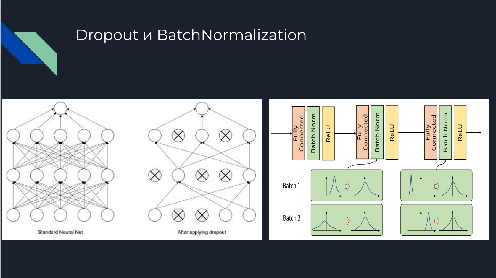
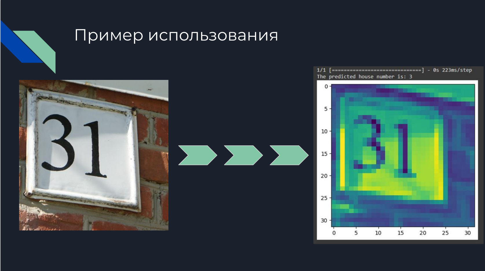

# 🏠 Распознавание номеров домов для робота-доставщика с помощью нейросети

Проект по разработке и обучению нейросети для точного определения и распознавания номеров домов на изображениях, полученных с камер робота-доставщика.

  
  

---

## 🎯 Цель проекта

Разработка модели компьютерного зрения, способной:
- находить номер дома на изображении;
- распознавать символы и предсказывать точный номер;
- работать в реальном времени на мобильной платформе (робот).

---

## 🧠 Используемые технологии

- Python 3.10  
- PyTorch / TorchVision  
- OpenCV  
- Albumentations (аугментации)  
- TensorBoard (визуализация)  
- Jupyter Notebook  
- ONNX (экспорт модели)

---

## 📁 Датасет

Использован кастомный датасет, собранный с камер робота-доставщика.  
Каждое изображение размечено в формате:
- `bbox`: координаты номера дома;
- `text`: строка, содержащая номер (например, `"17A"`).

Дополнительно:
- применяется генерация synthetic данных (набор шрифтов и домовых табличек);
- используются аугментации: повороты, шум, изменение яркости, искажения.

---

## 🧪 Архитектура модели

Модель состоит из двух частей:
1. **YOLOv5-tiny / SSD-lite** — обнаружение таблички с номером на изображении.
2. **CRNN (Convolutional Recurrent Neural Network)** — распознавание символов с таблички (OCR).

---
